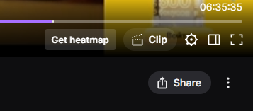
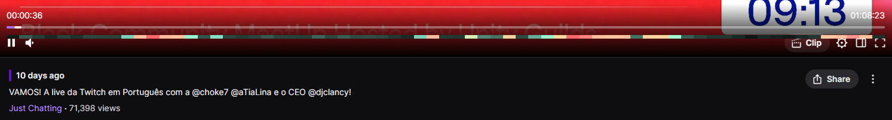

# TwitchVODEnhancer

**English** | [Русский](README_RU.md)

A userscript that adds a **chat activity heatmap** under the Twitch VOD seekbar. Warm colors (yellow, red) mark moments with lots of chat messages, cool colors (teal, black) mark quiet ones, so you can jump straight to the most interesting parts of a stream.

This is a 2026 rewrite of [sooqua/TwitchVODEnhancer](https://github.com/sooqua/TwitchVODEnhancer) (2017), which stopped working after Twitch redesigned its player and shut down the Kraken API and the `rechat` service.

## Screenshots





## Features

- On-demand loading: a **Get heatmap** button appears in the player controls, left of **Clip**. Nothing is requested until you click it (set `autoLoad: true` to build the map automatically). On error the button turns into **Retry heatmap**.
- Heatmap strip right below the native seekbar, aligned with the VOD timeline (1 minute per column by default).
- Hover tooltip with the activity level and the number of messages at that moment:

  | Tooltip | Meaning |
  |---|---|
  | chat was silent | no messages |
  | quiet | below 0.5× the typical level |
  | normal activity | 0.5×–1.5× |
  | chat is active | 1.5×–3× |
  | activity spike 🔥 | above 3× |

  The "typical level" is the median of all non-empty minutes of the VOD, so the scale adapts to both small and very busy streams.
- Clicking the heatmap seeks the video, just like the regular seekbar.
- The map fills in progressively while loading; a progress indicator (`chat: 66% · 5 406 msgs`) is shown above the seekbar and disappears 15 seconds after reaching 100%.
- Parallel loading: a ~5-hour VOD with ~10k messages takes about 15–20 seconds.
- Works with Twitch's SPA navigation: switching between VODs rebuilds the map, already loaded VODs are cached for the session.
- **No Client ID or API registration required.**

## Installation

1. Install a userscript manager, e.g. [Tampermonkey](https://www.tampermonkey.net/).
   On Chrome 138+ also open `chrome://extensions` → Tampermonkey → **Details** and enable **Allow User Scripts**.
2. Open [`TwitchVODEnhancer.user.js`](TwitchVODEnhancer.user.js), click **Raw** and confirm the installation.
3. Open any VOD (`https://www.twitch.tv/videos/...`) and click **Get heatmap** next to **Clip** — the heatmap appears under the seekbar.

If you have the old 2017 version installed, disable or remove it first.

## How it works

Twitch no longer offers a public API for VOD chat replay: Kraken was shut down in 2022, and Helix has no comments endpoint. The only working source is the internal GraphQL operation `VideoCommentsByOffsetOrCursor` that the Twitch player itself uses, and it requires a `Client-Integrity` token that cannot be generated outside the browser.

So the script:

1. Hooks `window.fetch` at `document-start` and copies the headers (`Client-Id`, `Client-Integrity`, `Authorization`, etc.) and the persisted query hash from Twitch's own GQL requests.
2. Gets the VOD length and splits the video into segments that are crawled in parallel via cursor pagination.
3. Counts messages per time bin and draws the heatmap on a `<canvas>` attached to `[data-a-target="player-seekbar"]`.

Your session headers are only sent to `gql.twitch.tv`, the same server Twitch already talks to; nothing goes to third parties. Requests made by the page itself pass through the hook unchanged.

> ⚠️ The script relies on an undocumented internal API and the current player markup. Twitch may change either at any time.

## Configuration

Edit the `CFG` object at the top of the script:

| Option | Default | Description |
|---|---|---|
| `binSec` | `60` | Width of one heatmap column, seconds |
| `stripHeight` | `6` | Height of the heatmap strip, px |
| `hitPad` | `3` | Extra hover area above/below the strip, px |
| `labelOffset` | `22` | How far above the seekbar the loading indicator is shown, px |
| `labelHideDelay` | `15000` | Hide the loading indicator N ms after reaching 100% |
| `concurrency` | `4` | Number of parallel loaders |
| `reqDelay` | `60` | Pause between requests within one loader, ms |
| `percentile` | `0.98` | Color normalization percentile, so a single spike does not wash out the rest |
| `autoLoad` | `false` | Build the heatmap automatically when a VOD opens, without the button |
| `debug` | `true` | Log `[TVE]` messages to the console |

## Troubleshooting

Open DevTools → Console on a VOD page and look for `[TVE]` messages. A normal run looks like this:

```
[TVE] headers captured: client-id, client-integrity, authorization, ...
[TVE] video 2889043122
[TVE] duration 17522 s
[TVE] heatmap attached below seekbar
[TVE] done: 9766 msgs in 16.8s
```

| Symptom | Likely cause / fix |
|---|---|
| No `headers captured` line | The script is not running in the page context. Check that the userscript manager is allowed to run user scripts and that the script has `@grant none`. |
| `unexpected response: …` | Twitch changed the GQL response format. Please open an issue with the log line. |
| Many `retry …` lines | Rate limiting. Lower `concurrency` to 2 or increase `reqDelay`. |
| Red `TVE: …` text above the seekbar | Loading failed; the error text is shown there and in the console. |
| Heatmap overlaps player buttons or labels | Adjust `stripHeight`, `hitPad` or `labelOffset`. |

Messages like `s.amazon-adsystem.com … ERR_CONNECTION_RESET` shown with `window.fetch @ userscript…` in the stack are Twitch's own (blocked) ad requests passing through the hook, not script errors.

## Credits

- Original idea and 2017 version: [sooqua](https://github.com/sooqua/TwitchVODEnhancer).
- Gradient palette is kept from the original.
